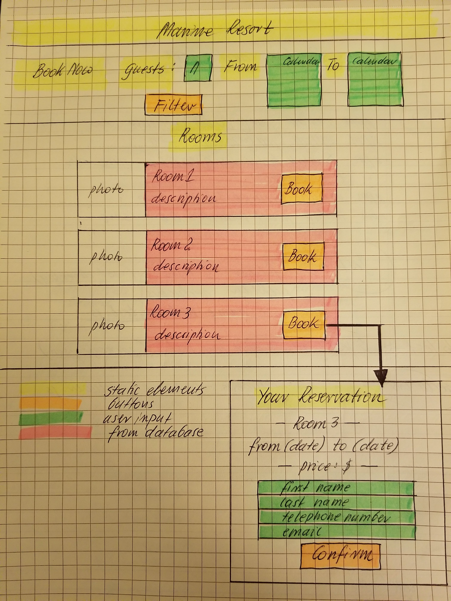
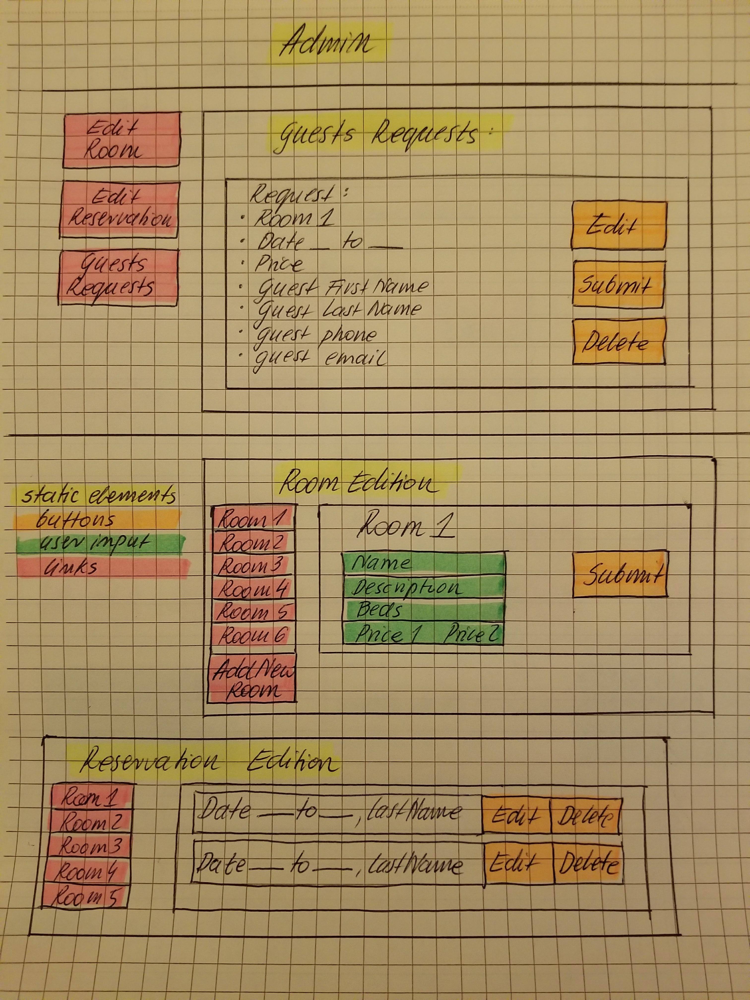
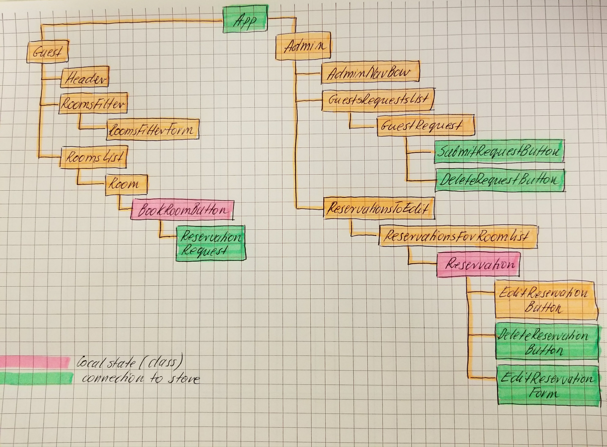
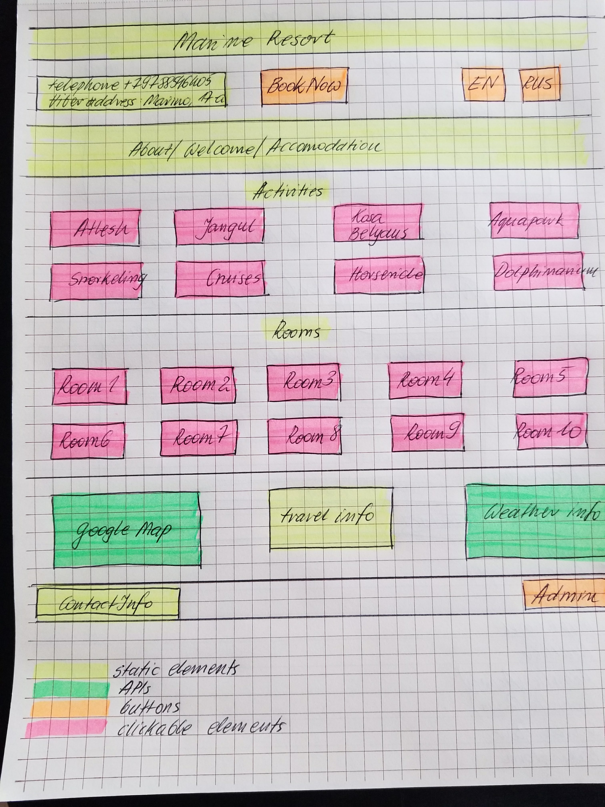

# Marine Resort

### It's an application that allows resort's guests to make a room reservation and allows manager to manage all information about the resort, including booking system.

#### By Malgorzata Haniszewska

## Description (full version)

This website is created to manage resort.
* Admin's panel is available after authentication.
* Admin can see chart with room availability during the year.
* Admin can edit room information.
* Admin can edit or delete reservation for each room.
* Admin can see guests' reservation requests.
* Admin can edit, submit or delete guests' reservation requests.
* User can choose the language the page is displayed in (different language and different currency: USD for English version and RUB for Russian version)
* User can see welcome information.
* User can see map with travel information.
* User can see current weather conditions.
* User can see activities.
* User can use a serching bar (filters: beds number, date) to see which rooms are available.
* If room is available guest is able to click `book` button.
* After clicking on `book` guest sees reservation information and labels to fill in with his/her personal information.
* After confirming the form above guest sees final information about reservation.
* User gets confirmation letter via email.

## MVP

### List of absolute minimum features the project requires to meet its goals:
#### Admin panel:
* Part to edit rooms.
* Part to edit and delete reservations for each room.
* Part with guests' reservation requests, where admin can edit, submit or delete requests.
#### User panel:
* Serching bar (filters: beds number, date) to see which rooms are available
* List of rooms.
* If certain room is available, `book` button is active.
* After clicking on `book` guest sees booking form with reservation details and labels to fill in with contact information.

### Visual Representation of MVP Layout
#### Guest Panel

#### Admin Panel

### Component Hierarchy

### Tools, frameworks, libraries, APIs, modules and/or other resources use to create this MVP
* HTML
* CSS
* JSX
* React
* Redux
* Firebase database (to store data)

## Full version of aplication

### List of additional features:
#### Admin panel:
* Authentication for admin.
* Admin can see chart with room availability during the year ( Gannt chart).
* When guest's request is accepted - it sends confirmation letter to user.
#### User panel:
* User can choose the language the page is displayed in (plus currency).
* Welcome information.
* Google map with travel information.
* Current weather conditions.
* List of activities.
* Activity details.
* After confirming the reservation form guest sees final information about reservation.

### Additional tools, frameworks, libraries, APIs, or other resources that these additional features require:
* Firebase authorization (admin authentication).
* Currency converter API
* Google Map API
* OpenWeather API

### Visual Representation of Full Version Layout

## Setup/Installation Requirements

* Clone GitHub repository to your personal device using terminal command `git clone https://github.com/yetka/react-redux-marine-resort`
* go to root directory of this project
* run `npm install`
* run `npm run start`
* navigate to `http://localhost:8080/` in the browser; the app will automatically reload if you change any of the source files

## Support and contact details

Contact emails: gosia.haniszewska@gmail.com

## Running linter

Run `npm run lint` to execute tests via [ESLint](https://eslint.org).

## License

This project is licensed under the MIT License.
